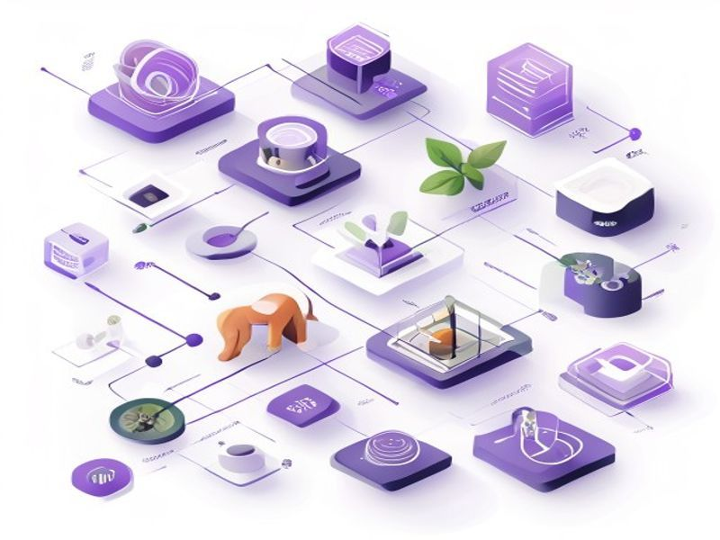

# Holistic dogfood evaluation skill

## TL;DR

**What**: A developer-only script (`pnpm dogfood` via `scripts/dogfood.ts`) that runs comprehensive quality evaluation across the entire wtfoc pipeline (ingest, edge extraction, edge resolution, storage, themes/clustering, signal scoring, search/trace) and produces structured, versioned, JSON-seriali.
**Status**: completed | **Priority**: P1
**User Stories**: 10

## Overview

A developer-only script (`pnpm dogfood` via `scripts/dogfood.ts`) that runs comprehensive quality evaluation across the entire wtfoc pipeline (ingest, edge extraction, edge resolution, storage, themes/clustering, signal scoring, search/trace) and produces structured, versioned, JSON-seriali

## Implementation History

| Increment | Status | Completion Date |
|-----------|--------|----------------|
| [0001-dogfood-eval](../../../../../increments/0001-dogfood-eval/spec.md) | ✅ completed | 2026-04-12T00:00:00.000Z |

## User Stories

- [US-001: Run full pipeline evaluation (P1)](./us-001-run-full-pipeline-evaluation-p1.md)
- [US-002: Run individual stage evaluation (P1)](./us-002-run-individual-stage-evaluation-p1.md)
- [US-003: Ingest quality evaluation (P1)](./us-003-ingest-quality-evaluation-p1.md)
- [US-004: Edge extraction quality evaluation (P1)](./us-004-edge-extraction-quality-evaluation-p1.md)
- [US-005: Edge resolution quality evaluation (P1)](./us-005-edge-resolution-quality-evaluation-p1.md)
- [US-006: Storage quality evaluation (P2)](./us-006-storage-quality-evaluation-p2.md)
- [US-007: Search and trace quality evaluation (P2)](./us-007-search-and-trace-quality-evaluation-p2.md)
- [US-008: Themes/clustering quality evaluation (P2)](./us-008-themes-clustering-quality-evaluation-p2.md)
- [US-009: Signal scoring quality evaluation (P2)](./us-009-signal-scoring-quality-evaluation-p2.md)
- [US-010: Report versioning and longitudinal comparison (P2)](./us-010-report-versioning-and-longitudinal-comparison-p2.md)
